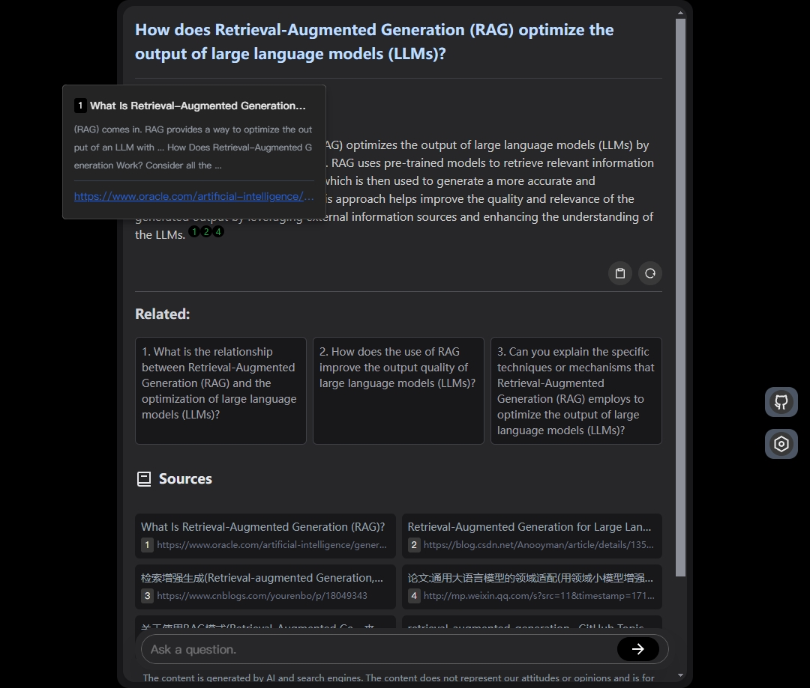

# Search with AI

**English** [中文](./README_CN.md)  

Build your own conversation-based search with AI, a simple implementation with Node.js & Vue3. [Live Demo](https://isou.chat/)  

<div align="center">
 </img>
</div>

repo: [GitHub](https://github.com/yokingma/search_with_ai)、 [Gitee](https://gitee.com/zac_ma/search_with_ai)  

## Features

* Built-in support for LLM: OpenAI, Google, Lepton, Ollama(Free)
* Built-in support for search engine: Bing, Sogou, Google, SearXNG(Free)
* Customizable pretty UI interface
* Support dark mode
* Support mobile display
* Support local LLM with Ollama
* Support i18n
* Support Continue Q&A with contexts.

## Deploy with Docker (recommended)

[Install Docker](https://docs.docker.com/install/).

* **Get the code.**

```shell
git clone https://github.com/yokingma/search_with_ai.git
cd search_with_ai
```

* **Edit** [.env](https://github.com/yokingma/search_with_ai/blob/main/.env) **file.**

For a quick start, no need to modify any configuration here, just run docker compose below.

```shell
...
# default is for docker-compose, could modify if you need.
OPENAI_KEY=freegpt35
OPENAI_PROXY_URL=http://freegpt35:3040/v1

# Local llm: Ollama hostname, could modify if you need.
OLLAMA_HOST=http://host.docker.internal:11434

# Searxng hostname, could modify if you need.
SEARXNG_HOSTNAME=http://searxng:8080
```

* **run with docker-compose. (No Key required)**

this contains SearXNG and FreeGPT3.5 default, just run

```shell
docker compose up -d
```

* or build and run with docker manually. (**optional**)

```shell
docker build -t my_image .
docker run -d -p 3000:3000 --name my_app my_image
# linux run with host network
# docker run -d --network host --name my_app my_image
```

then visit <http://localhost:3000>

* **Update**

Remember to save your **.env** settings if it has been changed before.

1. run ```git pull```
2. Delete all old containers and images using Docker Desktop or Docker CLI
3. run ```docker compose up -d```

## LLM

#### Support API (needs KEY)

* OpenAI ChatGPT
* Google Gemini
* Lepton LLama2、Mixtral8*7B
* AliYun Qwen
* Baidu Wenxin
* 01.ai
* Moonshot(Kimi)
* Tencent Hunyuan

#### Local LLM

Support [Ollama](https://github.com/ollama/ollama), just need run ollama serve.

## Search Engine

Built-in support for search engine: Bing, Sogou, Google, SearXNG

#### SearXNG (Free, No Key required)

install [SearXNG](https://github.com/searxng/searxng) with [searxng-docker](https://github.com/searxng/searxng-docker)
> SearXNG is a free internet metasearch engine which aggregates results from various search services and databases. The service does not track or profile its users, providing online anonymity for those who seek it. Additionally, SearXNG can be used over Tor for online anonymity.

When you install SearxNG, the only active output format by default is the HTML format. You need to activate the json format to use the API. This can be done by adding the following line to the settings.yml file:

```yaml
search:
    formats:
        - html
        - json
```

And set limiter to false:

```yaml
server:
   limiter: false # default is true
```

You can also set the host in .env:

```shell
# SEARXNG_HOSTNAME=<host>
```

#### Bing Search

To use the Bing Web Search API, please visit [this link](https://www.microsoft.com/en-us/bing/apis/bing-web-search-api) to obtain your Bing subscription key.
> The Bing Search API is billed, but has a free tier of 1000 calls per month.

#### Google Search

You have three options for Google Search: you can use the SearchApi Google Search API from [SearchApi](https://www.searchapi.io/), [Serper](https://www.serper.dev/) Google Search API from Serper, or opt for the [Programmable Search Engine](https://developers.google.com/custom-search) provided by Google.

#### Sogou Search

For users in China.

## Step by step setup

Required:
> Node.js >= 18

* **Server**

```shell
yarn install && yarn run build
```

* **Web**

```shell
cd web && yarn install && yarn run build
```

* **Config(.env)**

```ts
// .env
// Bing key
BING_SEARCH_KEY=your-key
// Google search key
GOOGLE_SEARCH_KEY=
GOOGLE_SEARCH_ID=
// aliyun key
ALIYUN_KEY=your-key
// baidu key
BAIDU_KEY=your-key
BAIDU_SECRET=your-secret
// google gemini key & base url
GOOGLE_KEY=
// Google api base url
GOOGLE_PROXY_URL=
// tencent KEY:ID, SECRET:KEY
TENCENT_KEY=
TENCENT_SECRET=
// Yi Key
YI_KEY=
// openai ChatGPT key
OPENAI_KEY=your-key
// openai base url
OPENAI_PROXY_URL=https://api.openai.com/v1
```

* **Run**
In the root of the project:

```shell
yarn run start 
```

* **Update**
In the root of the project:

```shell
git pull
yarn install
cd web && yarn install && yarn run build
```

Now you can visit <http://localhost:3000>
