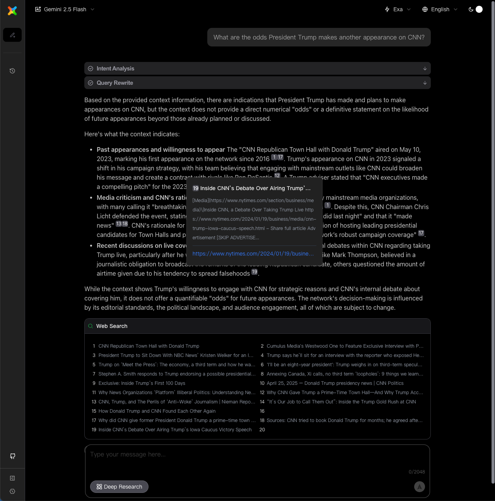

<a name="top"></a>

<div align="center">

# 🔍 SearChat

**AI-powered conversational search engine**

*Multi-model integration | Real-time conversational search | Deep Research support*

<p align="center">
  <a href="https://github.com/sear-chat/SearChat/stargazers"></a>
  <a href="https://github.com/sear-chat/SearChat/blob/main/LICENSE"></a>
  <a href="https://github.com/sear-chat/SearChat/issues/new"></a>
  <a href="https://github.com/sear-chat/SearChat/discussions/new?category=q-a"></a>
</p>

**English** | [中文](./README_ZH_CN.md) | [日本語](./README_JP.md)

</div>

---
## 推荐开源AI项目 / Recommended Open Source AI Project

### [WeClaws](https://github.com/baseclaw/weclaws)

WeClaws 是一个可一键部署的多用户微信 AI 助理机器人管理面板。你可以在 Web 端统一管理多个 AI 机器人，支持工具调用、Skills、MCP、子智能体、记忆、做梦、定时任务和沙盒执行等能力。

WeClaws is a one-click deployable management dashboard for multi-user WeChat AI assistant bots. It lets you manage multiple AI bots from the web and supports tool calling, Skills, MCP, sub-agents, memory, dreaming, scheduled tasks, and sandbox execution.

<div align="center">
  <a href="https://github.com/baseclaw/weclaws">
    </img>
  </a>
</div>

---

<div align="center">
 </img>
</div>

## 🌟 Project Overview

SearChat is a modern AI-powered conversational search engine built with **Turborepo monorepo architecture**, integrating **Node.js + Koa** backend and **Vue 3 + TypeScript** frontend.

🎯 **Key Features**:
- [x] 🤖 **Multi-model Support** - Compatible with OpenAI, Anthropic, Gemini APIs
- [x] 🔍 **Multiple Search Engines** - Support for Bing, Google, SearXNG and more
- [x] 💬 **Conversational Search** - Multi-turn chat-based search experience
- [x] ⏰ **Chat History** - Conversation history cached in browser (IndexedDB/LocalStorage)
- [x] 🧠 **Deep Research Mode** - Refactoring deep research functionality
- [ ] 🔌 **MCP Support** - (TODO) Support for external MCP services
- [ ] 🖼️ **Image Search** - (TODO) Support for image and video search
- [ ] 📂 **File Parsing** - (TODO) Support for document upload and content extraction

## ✨ Core Features

### 🧠 Deep Research
- **Intelligent Research Mode** - Deep research functionality
- **Iterative Exploration** - Workflow orchestration based on LangChain + LangGraph
- **Comprehensive Report Generation** - Automatically generate structured research reports

### 🤖 AI Model Support

> [!IMPORTANT]
> To achieve the best results, the model **must support Tool Call (Function Calling)**.

- OpenAI API compatible
- Google Gemini API compatible
- Anthropic API compatible
- Google Vertex AI compatible

### 🔍 Multi-Search Engine Integration

- **SearXNG** - Open source aggregated search, no API key required
- **Bing Search** - Microsoft Bing web search API
- **Google Search** - Google web search API
- **Tavily** - Tavily web search API
- **Exa** - Exa.ai web search API
- **Bocha** - BochaAI web search API
- **ChatGLM Web Search** - Zhipu AI free search plugin

### 🎨 Modern Interface Experience

- **Responsive Design** - Perfect adaptation for desktop and mobile
- **Dark/Light Theme** - Support for automatic system theme switching
- **Internationalization** - Multi-language interface (i18n)
- **Real-time Streaming** - Typewriter effect answer display
- **Contextual Conversation** - Support for multi-turn dialogue and history

## 🔬 Deep Research Mode

Deep Research mode uses AI-driven iterative search and analysis to generate comprehensive and in-depth research reports on any topic.

**Key Features**:

- 🔄 **Iterative Research** - Automatically identifies knowledge gaps and performs follow-up searches
- 📊 **Structured Reports** - Generates well-organized research reports with citations
- 🔗 **Citation Support** - Includes source references with configurable formats (`[[citation:1]]` or clickable URLs)
- 🎯 **Multi-Engine Search** - Leverages multiple search engines for comprehensive results

### 📹 Feature Demo

[Demo](https://youtu.be/W_455aI14hI)

### 📦 Standalone Usage

If you want to integrate Deep Research capabilities into your own Node.js project:

```bash
npm install deepsearcher
```

[](https://www.npmjs.com/package/deepsearcher)
[](https://www.npmjs.com/package/deepsearcher)

**Quick Example**:

```typescript
import { DeepResearch } from 'deepsearcher';

const deepResearch = new DeepResearch({
  searcher: async ({ query }) => {
    // Your search implementation
    return searchResults;
  },
  options: {
    type: 'openai',
    apiKey: 'your-api-key',
    enableCitationUrl: false, // Use [[citation:1]] format
  },
});

const agent = await deepResearch.compile();
const result = await agent.invoke({
  messages: [{ role: 'user', content: 'Your research question' }],
});
```

**Citation Format Options**:

- `enableCitationUrl: true` (default) - Outputs `<sup>[[1](url)]</sup>` format with clickable links
- `enableCitationUrl: false` - Outputs `[[citation:1]]` simple format

Documentation: [DeepResearch NPM Package](https://www.npmjs.com/package/deepsearcher)

## 🐳 Quick Deployment (Recommended Docker)

### 📋 Prerequisites

- [Install Docker](https://docs.docker.com/install/) and Docker Compose
- Prepare AI model API keys (configure in `model.json`)
- Optional: Configure search engine API keys (in `docker-compose.yaml`)
- Ensure network access to required services (SearXNG needs Google access)

### 🚀 One-Click Deployment

#### 1. Create [docker-compose.yaml](./deploy/docker-compose.yaml) file
Please refer to the [deploy/docker-compose.yaml](./deploy/docker-compose.yaml) file.

#### 2. Configure Environment Variables

Edit the `docker-compose.yaml` file and modify the corresponding environment variables in the `search_chat` service:

```yaml
services:
  search_chat:
    container_name: search_chat
    image: docker.cnb.cool/aigc/aisearch:v1.2.0-alpha
    environment:
      # Server Configuration
      - PORT=3000

      # Search Engine API Keys (configure as needed)
      - BING_SEARCH_KEY=your_bing_key
      - GOOGLE_SEARCH_KEY=your_google_key
      - GOOGLE_SEARCH_ID=your_google_cse_id
      - TAVILY_KEY=your_tavily_key
      - ZHIPU_KEY=your_zhipu_key
      - EXA_KEY=your_exa_key
      - BOCHA_KEY=your_bocha_key

      # Web Content Extraction (optional)
      - JINA_KEY=your_jina_key

      # SearXNG Configuration (included by default, ready to use)
      - SEARXNG_HOSTNAME=http://searxng:8080
      - SEARXNG_SAFE=0
      - SEARXNG_LANGUAGE=en
      - SEARXNG_ENGINES=bing,google
      - SEARXNG_IMAGES_ENGINES=bing,google

      # DeepResearch Configuration
      - DEEP_MAX_RESEARCH_LOOPS=3
      - DEEP_NUMBER_OF_INITIAL_QUERIES=3

      # Domain Whitelist (optional)
      - WHITELIST_DOMAINS=
    volumes:
      - ./model.json:/app/apps/server/dist/model.json
    ports:
      - "3000:3000"
    restart: always
```

#### 3. Configure AI Models (Required)

Create and edit the [model.json](./deploy/model.json) file in the same directory as docker-compose.yaml to configure AI models and API keys:

```json
[
  {
    "provider": "openai",
    "type": "openai",
    "baseURL": "https://api.openai.com/v1",
    "apiKey": "sk-your-openai-api-key",
    "apiMode": "openai-responses",
    "models": [
      {
        "name": "gpt-4o-mini",
        "alias": "GPT-4o Mini",
        "description": "OpenAI GPT-4o Mini model",
        "maxTokens": 262144,
        "intentAnalysis": true
      },
      {
        "name": "gpt-4o",
        "alias": "GPT-4o",
        "description": "OpenAI GPT-4o model",
        "maxTokens": 262144
      }
    ]
  },
  {
    "provider": "anthropic",
    "type": "anthropic",
    "baseURL": "https://api.anthropic.com/v1",
    "apiKey": "sk-your-anthropic-api-key",
    "models": [
      {
        "name": "claude-sonnet-4-5",
        "alias": "Claude Sonnet 4.5",
        "description": "Anthropic Claude Sonnet 4.5",
        "maxTokens": 131072
      }
    ]
  }
]
```

Models with `intentAnalysis: true` will be used for search intent analysis and query rewriting. It's recommended to set smaller models here to improve response speed.

**Configuration Description**:
- `provider`: Model provider name
- `type`: API type (openai/anthropic/google etc.)
- `baseURL`: API base URL
- `apiKey`: Your API key
- `apiMode`: Optional for OpenAI-compatible providers. Use `openai-completions` (default) for Chat Completions, or `openai-responses` for the OpenAI Responses API. Leave it unset for OpenAI-compatible endpoints that do not support the Responses API.
- `models`: Model list with name, alias, description and max tokens

When `apiMode` is set on an OpenAI provider, the main chat response, search intent analysis, and DeepResearch flows use the same mode.

#### 4. Start Services

```bash
docker compose up -d
```

#### 5. Access Application

Open your browser and visit: [http://localhost:3000](http://localhost:3000)

### 🔄 Update Deployment

```bash
# Stop services
docker compose down

# Pull latest image
docker pull docker.cnb.cool/aigc/searchchat:latest

# Restart
docker compose up -d
```

## 🔍 Search Engine Configuration

The project supports multiple search engines. Choose the appropriate search source based on your needs. SearXNG is recommended.

### 🆓 SearXNG (Recommended - Free & Open Source)

**Advantages**: Completely free, no API key required, aggregates multiple search sources, protects privacy

SearXNG is an open-source metasearch engine that aggregates results from multiple search services without tracking users. Built into Docker deployment, ready to use out of the box.

**Configuration Options**:
- `SEARXNG_ENGINES`: Set search engines (default: bing,google)
- `SEARXNG_LANGUAGE`: Search language (zh=Chinese, en-US=English, all=all)
- `SEARXNG_SAFE`: Safe search level (0=off, 1=moderate, 2=strict)

**[!IMPORTANT]**

Make sure to activate the json format to use the API. This can be done by adding the following line to the `searxng/settings.yml` file:
```yaml
search:
    formats:
        - html
        - json
```

## 💻 Local Development

### 📋 Requirements

- **Node.js** >= 20
- **Package Manager** yarn@3.5.1
- **Build Tool** Turborepo

### 🏗️ Project Architecture

```text
search_with_ai/
├── apps/
│   ├── server/          # Backend service (Koa + TypeScript)
│   │   ├── src/
│   │   │   ├── app.ts           # Application entry
│   │   │   ├── controller.ts    # Route controllers
│   │   │   ├── interface.ts     # Type definitions
│   │   │   └── model.json       # Model configuration
│   │   └── package.json
│   └── web/             # Frontend application (Vue 3 + TypeScript)
│       ├── src/
│       │   ├── pages/           # Page components
│       │   ├── stores/          # Pinia state management
│       │   └── components/      # Common components
│       └── package.json
├── deploy/              # Deployment configuration
│   ├── docker-compose.yaml
│   ├── .env.docker
│   └── model.json
└── package.json         # Root configuration
```

### 🚀 Development Workflow

#### 1. Install Dependencies

```bash
# Clone project
git clone https://github.com/sear-chat/SearChat.git
cd SearChat

# Install dependencies (run in root, will install all sub-project dependencies)
yarn install
```

#### 2. Configure Environment

Copy and edit server environment configuration:

```bash
# Copy environment configuration template
cp apps/server/.env apps/server/.env.local

# Edit configuration file
vim apps/server/.env.local
```

#### 3. Start Development Services

```bash
# Start both frontend and backend development servers
yarn dev

# Or use Turborepo command
turbo dev
```

Access URLs:

- Frontend: [http://localhost:5173](http://localhost:5173)
- Backend: [http://localhost:3000](http://localhost:3000)

#### Optional local AI tracing

SearChat can write OpenAI-compatible request traces to an
[AgentPond](https://github.com/marcusschiesser/agentpond) environment:

```bash
npx agentpond init
npx agentpond env init local --provider fs --root .agentpond/envs/local/objects
AGENTPOND_ENABLED=true FILES_SDK_PROVIDER=fs \
  FILES_SDK_ROOT=.agentpond/envs/local/objects yarn dev
```

Tracing is disabled unless `AGENTPOND_ENABLED=true`. When enabled, prompt and
response content is hidden; only operational metadata such as model, timing,
status, and token counts is exported to the store you configure.

#### 4. Build Production Version

```bash
# Build all applications
yarn build

# Or
turbo build
```

### 🔧 Development Tools

#### Backend Tech Stack

- **Framework**: Koa.js + TypeScript
- **AI Integration**: LangChain + LangGraph
- **Search Engines**: Multi-engine adapter pattern

#### Frontend Tech Stack

- **Framework**: Vue 3 + Composition API
- **Build**: Vite + TypeScript
- **UI Library**: TDesign Vue Next
- **State Management**: Pinia + persistence
- **Styling**: Tailwind CSS + Less

## 🤝 Contributing

Welcome to contribute to the project! Please follow these steps:

1. **Fork the project** to your GitHub account
2. **Create a feature branch** `git checkout -b feature/amazing-feature`
3. **Commit your changes** `git commit -m 'Add amazing feature'`
4. **Push the branch** `git push origin feature/amazing-feature`
5. **Create a Pull Request**

### 🐛 Issue Reporting

- [GitHub Issues](https://github.com/sear-chat/SearChat/issues) - Report bugs or feature requests
- [GitHub Discussions](https://github.com/sear-chat/SearChat/discussions) - Technical discussions and Q&A

## 📄 License

This project is licensed under the [MIT License](LICENSE).

## 🙏 Acknowledgments

- [SearXNG](https://github.com/searxng/searxng) - Open source search engine
- [LangChain](https://github.com/langchain-ai/langchain) - AI application development framework
- [Tencent EdgeOne](https://edgeone.ai/?from=github) - CDN acceleration support

---

<div align="center">

**⭐ If this project helps you, please give it a Star!**

[🚀 Back to top](#top)

</div>
