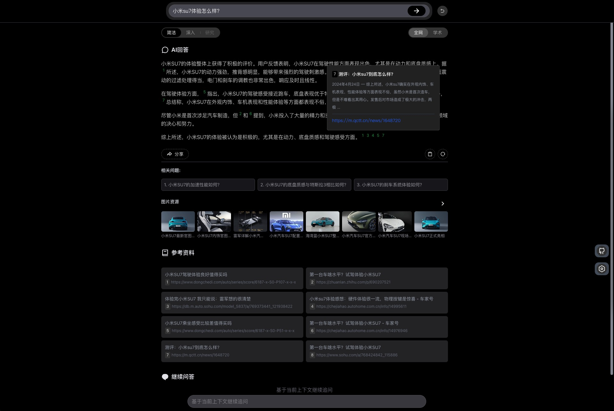

# Search with AI

[English](./README.md) **中文**  

基于AI大语言模型的对话式搜索引擎的一个基本实现，基于Node.js&Vue3。 [Live Demo](https://isou.chat/)  

<div align="center">
 </img>
</div>

仓库地址：[GitHub仓库](https://github.com/yokingma/search_with_ai)、 [Gitee仓库](https://gitee.com/zac_ma/search_with_ai)  

## 功能说明

* 内置主流的LLM接口支持，如OpenAI、Google、通译千问、百度文心一言、Lepton。
* 内置搜索引擎支持，如Bing、Sogou、Google、SearXNG（免费开源）。
* 简洁的搜索对话Web界面。
* Web界面支持暗色模式。
* Web界面支持移动端。
* 支持搜索引擎切换、AI模型切换。
* 支持本地大模型（基于Ollama）。
* 支持多语言(i18n)。
* 支持根据结果上下文继续问答。
* 缓存支持，刷新搜索结果页面的时候相同问题返回缓存结果，也支持强制重新生成答案。

## 使用 Docker 一键安装部署

[安装Docker](https://docs.docker.com/install/).

* **克隆仓库**

```shell
git clone https://github.com/yokingma/search_with_ai.git
cd search_with_ai
```

* **编辑** [.env](https://github.com/yokingma/search_with_ai/blob/main/.env)

如果你想一键快速体验，这里不需要修改任何配置，直接运行下面的docker compose即可。

```shell
...
# openai KEY, docker compose 默认带了FreeGPT35，如果你没有自己的Key, 这里保持默认
OPENAI_KEY=freegpt35
# openai proxy
OPENAI_PROXY_URL=http://freegpt35:3040/v1
...
# 如果需要在docker中访问本地部署的Ollama, 你可能不用改变这个变量。
OLLAMA_HOST=http://host.docker.internal:11434

# docker compose 默认带了SearXNG免费聚合搜索, 默认不需要修改
SEARXNG_HOSTNAME=http://searxng:8080
```

* **运行docker-compose. (不需要任何KYE)**

默认包含了 SearXNG 和 FreeGPT3.5，只需要运行：
> 前提是确保你的网络环境能访问Google&OpenAI

```shell
docker compose up -d
```

* 或者你也可以选择手动构建和运行（**可选的**）

```shell
docker build -t my_image .
docker run -d -p 3000:3000 --name my_app my_image
```

浏览器访问 <http://localhost:3000>

* **更新**

1. 运行 ```git pull``` （注意保存你的.env设置）

2. 删除所有旧的容器和镜像
3. 执行 ```docker compose down```
4. 执行 ```docker compose up -d```

## 大模型支持

#### 基于在线大模型的API（需要Key）

* OpenAI ChatGPT
* Google Gemini
* Lepton LLama2、Mixtral8*7B
* 阿里云通译千问
* 百度文心一言
* 零一万物
* 月之暗面（Kimi）
* 腾讯混元

#### 本地大模型支持（无需Key）

支持[Ollama](https://github.com/ollama/ollama)运行的本地大模型。运行的时候只需要启动ollama即可。

## 搜索引擎配置

内置了搜索引擎服务：Bing、Sogou、Google、SearXNG。

#### SearXNG (免费开源，不需要KEY)

安装 [SearXNG](https://github.com/searxng/searxng) ，推荐用Docker部署 [searxng-docker](https://github.com/searxng/searxng-docker)
> SearXNG 是一款免费的互联网元搜索引擎，它集合了来自多个搜索服务和数据库的结果。该服务不会追踪或构建其用户档案，为寻求在线匿名性的用户提供保护。此外，SearXNG 还可通过 Tor 网络来实现在线匿名访问。

安装 SearXNG 时，默认情况下唯一处于激活状态的输出格式是 HTML 格式。若要使用 API，您需要启用 json 格式。可以通过在 settings.yml 文件中添加以下行来实现：

```yaml
search:
    formats:
        - html
        - json
```

并且需要设置limiter为false:

```yaml
server:
   limiter: false # default is true
```

也可以设置SEARXNG_HOSTNAME (编辑.env文件):

```shell
# SEARXNG_HOSTNAME=<host>
```

#### Bing搜索

如果要使用必应搜索，需要注册并订阅[Bing搜索服务](https://www.microsoft.com/en-us/bing/apis/bing-web-search-api)，获取必应订阅密钥(key)。

> Bing搜索接口是收费的，但是每月有1000次免费调用额度。

#### Google搜索

如果要使用谷歌搜索引擎， 需要[注册谷歌搜索API服务](https://developers.google.com/custom-search)，每天有100次免费搜索额度。

#### Sogou搜索

内置的Sogou搜索并非直接调用API实现（似乎没有开放的API），只是通过网页搜索获取搜索结果。
> 内置的Sogou搜索优点是免费的，**但是会触发人机验证**，遇到不返回参考资料的情况可以手动打开sogou.com随便搜索关键词，根据提示手动验证一下解除。

## 普通安装部署

需要：
> Node.js >= 18

国内用户推荐使用阿里云通译千问大模型，在阿里云[模型服务灵积](https://dashscope.aliyun.com/)注册可以获取密钥(key)，通译千问部分API使用是免费的(qwen-max、qwen-max-1201、qwen-max-longcontext)，除了longcontext模型其他限制是60次请求/分钟。

* **服务端**

```shell
yarn install && yarn run build
```

* **前端页面**

```shell
cd web && yarn install && yarn run build
```

* **配置**

```ts
// .env
// Bing key
BING_SEARCH_KEY=your-key
// Google search key
GOOGLE_SEARCH_KEY=
GOOGLE_SEARCH_ID=
// aliyun key
ALIYUN_KEY=your-key
// baidu key
BAIDU_KEY=your-key
BAIDU_SECRET=your-secret
// google gemini key & base url
GOOGLE_KEY=
// Google api base url
GOOGLE_PROXY_URL=
// tencent KEY:ID, SECRET:KEY
TENCENT_KEY=
TENCENT_SECRET=
// Yi Key
YI_KEY=
// openai ChatGPT key
OPENAI_KEY=your-key
// openai base url
OPENAI_PROXY_URL=https://api.openai.com/v1
```

* **启动**
在项目根目录中执行:

```shell
yarn run start 
```

* **更新**
在项目根目录执行

```shell
git pull
yarn install
cd web && yarn install && yarn run build
```

启动成功后可以在浏览器打开<http://localhost:3000> 即可使用。
