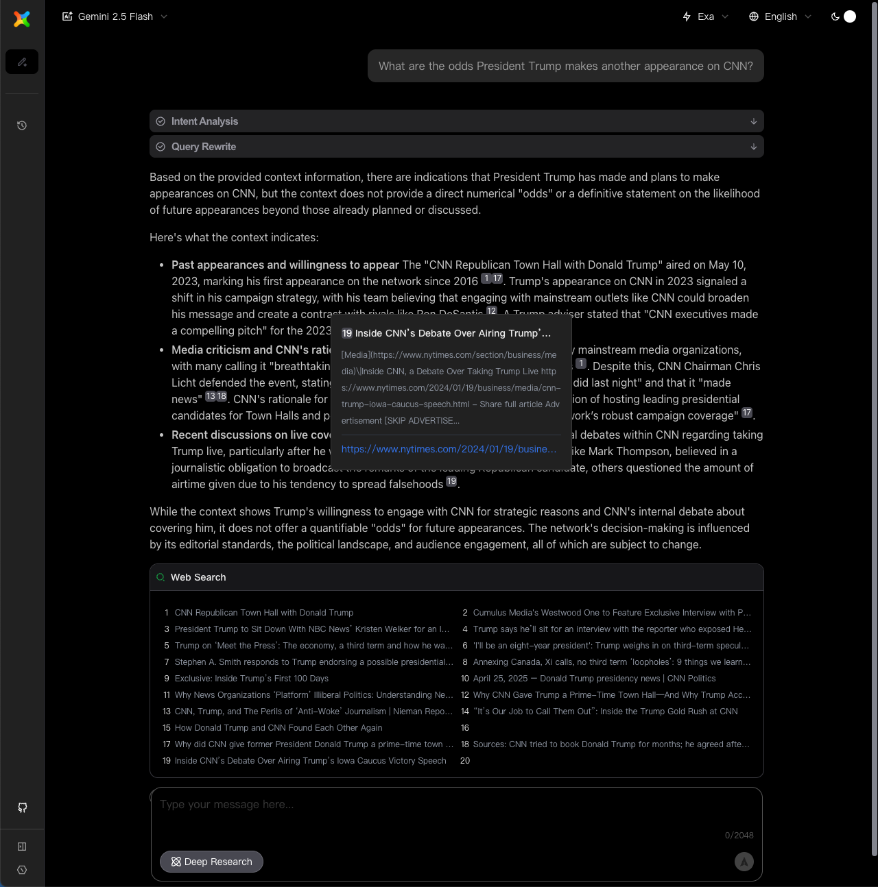

<a name="top"></a>

<div align="center">

# 🔍 SearChat

**AI大言語モデルベースの対話型検索エンジン**

*マルチモデル・検索エンジン統合 | リアルタイム対話検索 | Deep Research 深度研究対応*

<p align="center">
  <a href="https://github.com/sear-chat/SearChat/stargazers"></a>
  <a href="https://github.com/sear-chat/SearChat/blob/main/LICENSE"></a>
  <a href="https://github.com/sear-chat/SearChat/issues/new"></a>
  <a href="https://github.com/sear-chat/SearChat/discussions/new?category=q-a"></a>
</p>

[English](./README.md) | [中文](./README_ZH_CN.md) | **日本語**

</div>

---

<div align="center">
 </img>
</div>

## 🌟 プロジェクト概要

SearChat は、現代的なAI大言語モデルベースの対話型検索エンジンです。

🎯 **主要機能**：
- [x] 🤖 **マルチモデル対応** - OpenAI、Anthropic、Gemini互換API対応
- [x] 🔍 **複数検索エンジン** - Bing、Google、SearXNG等の多様な検索ソース対応
- [x] 💬 **対話型検索** - マルチターンチャット式検索
- [x] ⏰ **対話履歴** - ブラウザ内対話履歴キャッシュ（IndexedDB/LocalStorage）
- [x] 🧠 **Deep Research モード** - 深度研究機能
- [ ] 🔌 **MCP対応** - （TODO）外部MCPサービス接続対応
- [ ] 🖼️ **画像検索** - （TODO）画像・動画検索対応
- [ ] 📂 **ファイル解析** - （TODO）ドキュメントアップロード・内容抽出対応

## ✨ コア機能

### 🧠 Deep Research 深度研究
- **インテリジェント研究モード** - 深度研究機能
- **反復的探索** - LangChain + LangGraphベースのワークフロー編成
- **包括的レポート生成** - 構造化された研究レポートの自動生成

### 🤖 AIモデル対応

> [!IMPORTANT]
> 最良の結果を得るには、モデルが **Tool Call (Function Calling)** をサポートしている必要があります。

- OpenAI API互換
- Google Gemini API互換
- Anthropic API互換
- Google Vertex AI 互換

### 🔍 マルチ検索エンジン統合

- **SearXNG** - オープンソース統合検索、API Key不要
- **Bing Search** - Microsoft公式検索API
- **Google Search** - 複数のAPIアクセス方式対応
- **Tavily** - LLM最適化検索エンジン
- **Exa** - Exa.ai ウェブ検索API
- **Bocha** - BochaAI ウェブ検索API
- **ChatGLM Web Search** - 智谱AI無料検索プラグイン

### 🎨 モダンなインターフェース体験

- **レスポンシブデザイン** - デスクトップ・モバイル完全対応
- **ダーク/ライトテーマ** - システムテーマ自動切替対応
- **国際化対応** - 多言語インターフェース（i18n）
- **リアルタイムストリーミング** - タイプライター効果の回答表示
- **コンテキスト対話** - マルチターン対話・履歴記録対応

## 🔬 Deep Research 深度研究モード

Deep Research モードは、AI駆動の反復的検索・分析により、あらゆるトピックに対して包括的で深度のある研究レポートを生成します。

### 📹 機能デモ

[機能デモ](https://youtu.be/W_455aI14hI)

### 📦 独立使用

Node.jsプロジェクトにDeep Research機能を統合したい場合：

```bash
npm install deepsearcher
```

詳細ドキュメント：[DeepResearch NPMパッケージ](https://www.npmjs.com/package/deepsearcher)

## 🐳 クイックデプロイ（Docker推奨）

### 📋 事前準備

- [Docker](https://docs.docker.com/install/) と Docker Compose のインストール
- AIモデルAPI Key の準備（`model.json`で設定）
- オプション：検索エンジンAPI Key の設定（`docker-compose.yaml`で設定）
- 関連サービスへのネットワークアクセス確保（SearXNGはGoogleアクセスが必要）

### 🚀 ワンクリックデプロイ

#### 1. [docker-compose.yaml](./deploy/docker-compose.yaml) ファイルの作成
[deploy/docker-compose.yaml](./deploy/docker-compose.yaml) ファイルを参照してください。

#### 2. 環境変数の設定

`docker-compose.yaml` ファイルを編集し、`search_chat` サービスの対応する環境変数を修正：

```yaml
services:
  search_chat:
    container_name: search_chat
    image: docker.cnb.cool/aigc/aisearch:v1.2.0-alpha
    environment:
      # サーバー設定
      - PORT=3000

      # 検索エンジン API Keys（必要に応じて設定）
      - BING_SEARCH_KEY=your_bing_key
      - GOOGLE_SEARCH_KEY=your_google_key
      - GOOGLE_SEARCH_ID=your_google_cse_id
      - TAVILY_KEY=your_tavily_key
      - ZHIPU_KEY=your_zhipu_key
      - EXA_KEY=your_exa_key
      - BOCHA_KEY=your_bocha_key

      # Webコンテンツ抽出（オプション）
      - JINA_KEY=your_jina_key

      # SearXNG設定（デフォルト含有、すぐに使用可能）
      - SEARXNG_HOSTNAME=http://searxng:8080
      - SEARXNG_SAFE=0
      - SEARXNG_LANGUAGE=ja
      - SEARXNG_ENGINES=bing,google
      - SEARXNG_IMAGES_ENGINES=bing,google

      # DeepResearch 設定
      - DEEP_MAX_RESEARCH_LOOPS=3
      - DEEP_NUMBER_OF_INITIAL_QUERIES=3

      # ドメインホワイトリスト（オプション）
      - WHITELIST_DOMAINS=
    volumes:
      - ./model.json:/app/dist/model.json
    ports:
      - "3000:3000"
    restart: always
```

#### 3. AIモデル設定（必須）

docker-compose.yamlと同じディレクトリに [model.json](./deploy/model.json) ファイルを作成・編集し、AIモデルとAPI Keyを設定：

```json
[
  {
    "provider": "openai",
    "type": "openai",
    "baseURL": "https://api.openai.com/v1",
    "apiKey": "sk-your-openai-api-key",
    "models": [
      {
        "name": "gpt-4o-mini",
        "alias": "GPT-4o Mini",
        "description": "OpenAI GPT-4o Mini モデル",
        "maxTokens": 262144,
        "intentAnalysis": true
      },
      {
        "name": "gpt-4o",
        "alias": "GPT-4o",
        "description": "OpenAI GPT-4o モデル",
        "maxTokens": 262144
      }
    ]
  }
]
```

`intentAnalysis: true`に設定されたモデルは、検索意図分析とクエリ書き換えに使用されます。応答速度を向上させるため、ここでは小さなモデルを設定することをお勧めします。

#### 4. サービス開始

```bash
docker compose up -d
```

#### 5. アプリケーションアクセス

ブラウザで [http://localhost:3000](http://localhost:3000) にアクセス

### 🔄 デプロイ更新

```bash
# サービス停止
docker compose down

# 最新イメージ取得
docker pull docker.cnb.cool/aigc/searchchat:latest

# 再起動
docker compose up -d
```

## 🔍 検索エンジン設定

プロジェクトは複数の検索エンジンをサポートしており、ニーズに応じて適切な検索ソースを選択できます。SearXNG検索エンジンの使用を推奨します。

### 🆓 SearXNG (推奨 - 無料オープンソース)

**利点**：完全無料、API Key不要、複数検索ソースの統合、プライバシー保護

SearXNGは、複数の検索サービスの結果を統合し、ユーザーを追跡しないオープンソースのメタ検索エンジンです。Dockerデプロイに内蔵されており、すぐに使用できます。

**設定オプション**：
- `SEARXNG_ENGINES`: 検索エンジンの設定 (デフォルト: bing,google)
- `SEARXNG_LANGUAGE`: 検索言語 (zh=中国語, en-US=英語, all=全て)
- `SEARXNG_SAFE`: セーフサーチレベル (0=オフ, 1=中程度, 2=厳格)

**[!重要]**

APIを使用するためにjson形式を有効にしてください。これは`searxng/settings.yml`ファイルに以下の行を追加することで実行できます：
```yaml
search:
    formats:
        - html
        - json
```

## 💻 ローカル開発

### 📋 環境要件

- **Node.js** >= 20
- **パッケージマネージャー** yarn@3.5.1
- **ビルドツール** Turborepo

### 🏗️ プロジェクト構成

```text
search_with_ai/
├── apps/
│   ├── server/          # バックエンドサービス (Koa + TypeScript)
│   │   ├── src/
│   │   │   ├── app.ts           # アプリケーションエントリ
│   │   │   ├── controller.ts    # ルートコントローラー
│   │   │   ├── interface.ts     # 型定義
│   │   │   └── model.json       # モデル設定
│   │   └── package.json
│   └── web/             # フロントエンドアプリケーション (Vue 3 + TypeScript)
│       ├── src/
│       │   ├── pages/           # ページコンポーネント
│       │   ├── stores/          # Pinia状態管理
│       │   └── components/      # 共通コンポーネント
│       └── package.json
├── deploy/              # デプロイ設定
│   ├── docker-compose.yaml
│   ├── .env.docker
│   └── model.json
└── package.json         # ルートディレクトリ設定
```

### 🚀 開発ワークフロー

#### 1. 依存関係のインストール

```bash
# プロジェクトのクローン
git clone https://github.com/sear-chat/SearChat.git
cd SearChat

# 依存関係のインストール (ルートで実行、全サブプロジェクトの依存関係を自動インストール)
yarn install
```

#### 2. 環境設定

サーバー環境設定をコピー・編集：

```bash
# 環境設定テンプレートのコピー
cp apps/server/.env apps/server/.env.local

# 設定ファイルの編集
vim apps/server/.env.local
```

#### 3. 開発サービスの開始

```bash
# フロントエンド・バックエンド開発サーバーを同時起動
yarn dev

# またはTurborepoコマンドを使用
turbo dev
```

アクセスURL：

- フロントエンド: [http://localhost:5173](http://localhost:5173)
- バックエンド: [http://localhost:3000](http://localhost:3000)

#### 4. 本番版のビルド

```bash
# 全アプリケーションのビルド
yarn build

# または
turbo build
```

### 🔧 開発ツール

#### バックエンド技術スタック

- **フレームワーク**: Koa.js + TypeScript
- **AI統合**: LangChain + LangGraph
- **検索エンジン**: マルチエンジンアダプターパターン

#### フロントエンド技術スタック

- **フレームワーク**: Vue 3 + Composition API
- **ビルド**: Vite + TypeScript
- **UIライブラリ**: TDesign Vue Next
- **状態管理**: Pinia + 永続化
- **スタイリング**: Tailwind CSS + Less

## 🤝 貢献

プロジェクトへの貢献を歓迎します！以下の手順に従ってください：

1. **プロジェクトをFork** してGitHubアカウントに追加
2. **機能ブランチを作成** `git checkout -b feature/amazing-feature`
3. **変更をコミット** `git commit -m 'Add amazing feature'`
4. **ブランチをプッシュ** `git push origin feature/amazing-feature`
5. **Pull Requestを作成**

### 🐛 問題報告

- [GitHub Issues](https://github.com/sear-chat/SearChat/issues) - バグ報告や機能リクエスト
- [GitHub Discussions](https://github.com/sear-chat/SearChat/discussions) - 技術討論とQ&A

## 📄 ライセンス

このプロジェクトは[MITライセンス](LICENSE)の下で公開されています。

## 🙏 謝辞

- [SearXNG](https://github.com/searxng/searxng) - オープンソース検索エンジン
- [LangChain](https://github.com/langchain-ai/langchain) - AIアプリケーション開発フレームワーク
- [Tencent EdgeOne](https://edgeone.ai/?from=github) - CDN加速サポート

---

<div align="center">

**⭐ このプロジェクトが役に立った場合は、Starをお願いします！**

[🚀トップに戻る](#top)

</div>