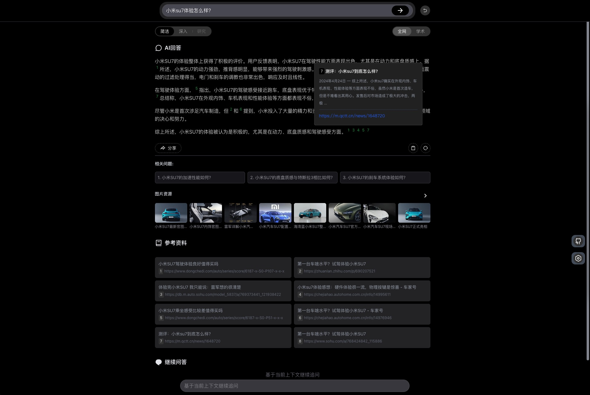
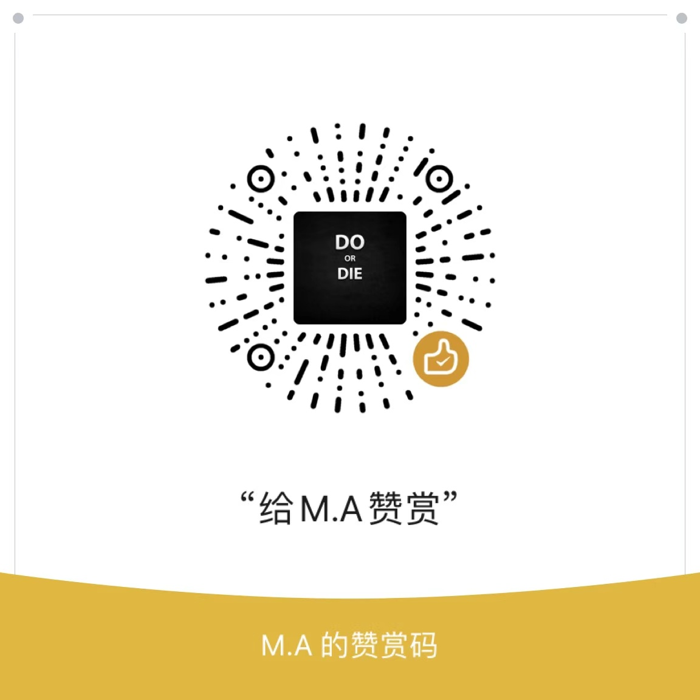

<a name="top"></a>
# Open AI Search (支持 DeepResearch)

<br>
<p align="center">
  基于AI大语言模型的搜索引擎，支持DeepResearch生成详细报告，支持DeepSeek R1深度思考。基于Node.js&Vue3。适合新手入门AI大模型开发参考:)，文档后有交流群二维码。
</p>
<p align="center">
  <a href="https://isou.chat/">Live Demo</a>
</p>

<p align="center">
  <a href="https://github.com/yokingma/search_with_ai/stargazers"></a>
  <a href="https://github.com/yokingma/search_with_ai/blob/main/LICENSE"></a>
  <a href="https://github.com/yokingma/search_with_ai/issues/new"></a>
  <a href="https://github.com/yokingma/search_with_ai/discussions/new?category=q-a"></a>
</p>

[English](./README.md) **中文** [日本語](./README_JP.md)

<div align="center">
 </img>
</div>

仓库地址：[GitHub仓库](https://github.com/yokingma/search_with_ai) [腾讯CNB](https://cnb.cool/isou/AiSearch)

## 功能说明

* 🔍 **新增：** 支持类似OpenAI/Gemini/Perplexity的"**Deep Research**"功能。
* 内置主流的LLM接口支持，如OpenAI、Google、DeepSeek(R1)、SiliconFlow、腾讯混元、通译千问、百度、Lepton、零一万物、月之暗面等。
* 支持本地大模型（基于Ollama、lmStudio）。
* 内置搜索引擎支持，如Bing、Sogou、Google、[Tavily](https://tavily.com/)、[SearXNG](https://github.com/searxng/searxng), 支持ChatGLM Web搜索插件 [作为搜索引擎, 目前免费]。
* 简洁的搜索对话Web界面，支持暗色模式、移动端。
* 支持搜索引擎切换、AI模型切换。
* 支持多语言（i18n）。
* 支持根据上下文结果继续问答。
* 支持回答结果缓存（可以强制刷新）。
* 支持图片搜索。

## 关于 DeepResearch

支持类似OpenAI/Gemini/Perplexity的"Deep Research"功能，通过搜索引擎，Web刮削和AI大模型对任何主题或者问题进行迭代，深入研究并生成报告。项目参考了[dzhng/deep-research](https://github.com/dzhng/deep-research)的实现。

https://github.com/user-attachments/assets/da5e038d-5e0a-4a6f-bae2-b1a58eee193e

**注意:**

- **警告:** 消耗大量Tokens.
- 需要AI接口支持`Function Calling`.
- 使用JINA.ai提取网页内容(可以不配置KEY, 免费限速: 20RPM).

**工作流程:**

1. 分析用户查询
2. 生成跟进问题以细化研究方向
3. 生成并执行搜索查询
4. 处理和分析搜索结果
5. 基于`步骤4`进行递归探索
6. 生成全面的报告

> [!NOTE]
> 如果你想在自己的(Node.js)项目中集成DeepResearch的能力，推荐使用下面这个npm包， 基于LangGraph构建，详细使用说明：[DeepResearch](https://github.com/yokingma/deepresearch)

```shell
npm install deepsearcher
```

## 使用 Docker 安装部署

**注意：使用SearXNG搜索引擎请确保你的网络能正常访问到Google**

[安装Docker](https://docs.docker.com/install/).

```shell
docker pull docker.cnb.cool/aigc/aisearch
```

> 项目预构建Docker镜像 [CNB.cool](https://cnb.cool/aigc/AiSearch) (国内镜像源 > 制品库)

1、**克隆仓库**

```shell
git clone https://github.com/yokingma/search_with_ai.git
cd search_with_ai
```

2、**编辑** [.env.docker](https://github.com/yokingma/search_with_ai/blob/main/.env) 文件位于```deploy```目录下

在此处配置你的KEY[如 OpenAI、Google、DeepSeek、阿里云 ]即可。
> 如果修改了.env.docker文件，只需要重启Docker容器即可生效。

```shell
# 示例
# openai KEY, docker compose 默认带了FreeGPT35，如果你没有自己的Key, 这里保持默认
OPENAI_KEY=#your key
...
# docker compose 部署默认带了SearXNG聚合搜索, 默认不需要修改
SEARXNG_HOSTNAME=http://searxng:8080
```

3、[可选] 如果需要修改`BaseUrl`、`模型名称`, 请修改[model.json](https://github.com/yokingma/search_with_ai/blob/main/deploy/model.json)文件。

```json
{
  "provider": "openai",
  "type": "openai",
  "baseURL": "https://api.openai.com/v1",
  "models": ["o1-preview", "o1-mini", "gpt-4o", "gpt-4o-mini"]
}
```

4、在```deploy```目录下运行：

```shell
# 默认包含了 SearXNG 服务
docker compose up -d
```

浏览器访问 <http://localhost:3000>

5、 **更新**

- 手动删除旧版本的镜像（如果需要）
- 执行 ```docker compose down```
- 执行 ```docker compose up -d```

## 搜索引擎配置

内置了搜索引擎服务：Bing、Sogou、Google、SearXNG。

#### 推荐使用SearXNG (免费开源，不需要KEY)

安装 [SearXNG](https://github.com/searxng/searxng) ，推荐用Docker部署 [searxng-docker](https://github.com/searxng/searxng-docker)
> SearXNG 是一款免费的互联网元搜索引擎，它集合了来自多个搜索服务和数据库的结果。该服务不会追踪或构建其用户档案，为寻求在线匿名性的用户提供保护。此外，SearXNG 还可通过 Tor 网络来实现在线匿名访问。

安装 SearXNG 时，默认情况下唯一处于激活状态的输出格式是 HTML 格式。若要使用 API，您需要启用 json 格式。可以通过在 settings.yml 文件中添加以下行来实现：

```yaml
search:
    formats:
        - html
        - json
```

并且需要设置limiter为false:

```yaml
server:
   limiter: false # default is true
```

也可以设置SEARXNG_HOSTNAME (编辑.env文件):

```shell
# SEARXNG_HOSTNAME=<host>
```

#### Bing搜索

如果要使用必应搜索，需要注册并订阅[Bing搜索服务](https://www.microsoft.com/en-us/bing/apis/bing-web-search-api)，获取必应订阅密钥(key)。

> Bing搜索接口是收费的，但是每月有1000次免费调用额度。

#### Google搜索

如果要使用谷歌搜索引擎， 需要[注册谷歌搜索API服务](https://developers.google.com/custom-search)，每天有100次免费搜索额度。

#### Sogou搜索

内置的Sogou搜索并非直接调用API实现，只是通过简单的网页爬取获取搜索结果。
> 内置的Sogou搜索本地测试用（只是简单的网页爬取），**会触发人机验证**，遇到不返回参考资料的情况可以手动打开sogou.com随便搜索关键词，根据提示手动验证一下解除。

#### ChatGLM Web Search插件
[2024/09/17] 新增智谱AI的ChatGLM Web Search插件，作为中文搜索引擎使用。
> 智谱AI的glm-flash目前免费，其Web Search插件目前也是免费，基于结合这两者新增了ChatGLM作为免费的中文搜索引擎。

#### Jina Reader URL API
[2024/11/24] 新增[Jina](https://jina.ai/) Reader URL API，支持完整的网页内容抓取。
WEB页面选择[研究]选项模式的时候会调用Jina API抓取网页的全文内容作为AI的上下文参考资料，需要配置JINA_KEY：

```shell
# JINA API KEY
JINA_KEY=#your key
```

## 部署&开发

> Node.js >= 20
> Turborepo
> PackageManager: yarn@3.5.1

* **项目结构**

```text
apps/
  | server: 服务端
  | web: 前端
deploy/
  | docker-compose.yaml: docker部署文件
  | .env.docker: 服务端参数配置文件
  | model.json: 服务端模型配置文件
  ...
```

* **开发&构建**
在项目根目录中执行:

```shell
turbo dev
# or
turbo build
```

* **更新**
在项目根目录执行

```shell
git pull
```

## API

项目前后端分离， 如果你需要使用API服务，也可以单独部署后端服务。

HOST: <http://localhost:3000>

- ```POST /api/search```  AI搜索

```json
// 请求参数 Request body
{
  "q": "今日新闻", // [必填]搜索关键词
  "model": "qwen-max", // [必填]模型名称
  "provider": "ollama", // [必选]大模型服务[], 如ollama、lmstudio、openai、deepseek等
  "engine": "bing", // [必填]搜索引擎，默认bing

  "stream": true, // [可选]是否流式输出，默认true
  "reload": false, // [可选]是否强制刷新缓存，默认false
  "categories": [], // [可选]SearXNG搜索引擎分类，默认[]
  "mode": "simple", // [可选]搜索模式，type TMode = "simple" | "deep" | "research"
  "language": "all", // [可选]SearXNG搜索引擎语言
}
```

**[stream = false] 非流式输出**

```json
// 响应参数 Response body
{
  "reasoningContent": "text", // AI推理过程[如果有]
  "content": "text", // AI回答答案
  "contexts": [], // 上下文搜索结果
  "related": [], // 相关搜索问题
  "images": [], // 图片搜索结果
}
```

**[stream = true] 流式输出**

```text
data: {"data": { "reasoningContent": "..." } }\n\n
data: {"data": { "answer": "I" } }\n\n
data: {"data": { "answer": "'m " } }\n\n
data: {"data": { "answer": "a robot" } }\n\n
data: {"data": { "image": {...} } }\n\n
data: {"data": { "image": {...} } }\n\n
data: {"data": { "context": {...} } }\n\n
data: {"data": { "context": {...} } }\n\n
data: {"data": { "related": {...} } }\n\n
data: {"data": { "related": {...} } }\n\n
```

参数类型说明

```ts
// 搜索引擎支持类型
export enum ESearchEngine {
  GOOGLE = 'GOOGLE',
  BING = 'BING',
  SOGOU = 'SOGOU',
  SEARXNG = 'SEARXNG',
  CHATGLM = 'CHATGLM'
}

// SearXNG搜索引擎分类
export enum ESearXNGCategory {
  SCIENCE = 'science',
  IT = 'it',
  GENERAL = 'general',
  IMAGES = 'images',
  VIDEOS = 'videos',
  NEWS = 'news',
  MUSIC = 'music'
}

// 搜索模式
export type TMode = 'simple' | 'deep' | 'research'
```

- ```GET /api/models``` 获取可用模型列表[只能获得提供了KEY的模型]

## 联系

<div align="center">
  </img>
  <div>如果你喜欢这个项目</div>
</div>

<div align="center">
 </img>
 <div>扫码添加助手进群交流</div>
</div>

## 许可证

此存储库的源代码在[MIT许可证](LICENSE)下提供。

[🚀回到顶部](#top)