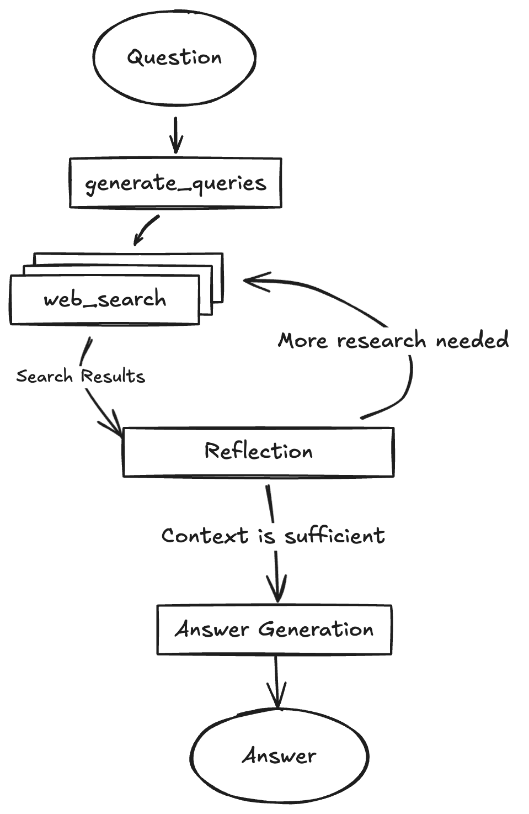

# 🤖 DeepResearch Agent with LangGraph🦜🕸️

DeepResearch Agent with LangGraph, using any LLM models, search engine, RAG retrieval.

> [!NOTE]
> This package is part of the [search_with_ai](https://github.com/yokingma/search_with_ai) monorepo.
> The original standalone repository is archived at [deepresearch](https://github.com/yokingma/deepresearch).
>
> The code logic referenced [Google's Gemini LangGraph Project](https://github.com/google-gemini/gemini-fullstack-langgraph-quickstart).

A LangGraph-powered research agent that performs comprehensive web research through dynamic query generation, iterative refinement, and citation-supported responses using any LLM model, search engine, or RAG retrieval.

```bash
# Node.js
npm install deepsearcher # or yarn add deepsearcher
```

## Features

- 🧠 Deep Research Agent based on LangGraph
- 🔍 Dynamic search query generation using any LLM model
- 🌐 Integrated web research through web search engines or RAG retrieval
- 🤔 Reflective reasoning, identifying knowledge gaps and optimizing searches
- 📄 Generate cited answers based on collected sources

## 🚀 Getting Started

```ts
import { DeepResearch, type SearcherFunction } from 'deepsearcher';

// Search engine adapter
const searcher: SearcherFunction = ({ query, id }) => {
  // You need to provide a searcher function
  // which can be a web search engine or a RAG retrieval function
}

const instance = new DeepResearch({
  searcher,
  // LLM Provider Options
  options: {
    type: 'openai', // 'openai' | 'anthropic' | 'gemini' | 'vertexai'
    apiKey: 'YOUR_API_KEY',
    baseURL: 'https://api.openai.com/v1', // Optional, for custom endpoints
    systemPrompt: 'You are a helpful research assistant.', // Optional, default provided
    temperature: 0.1, // Optional, default 0.1, controls randomness (0.0-2.0)
  },
});

// langgraph compile
const agent = await instance.compile();

// debug (optional)
agent.debug = true;

// use the stream() method. 
const chunks = await agent.stream(
  {
    messages: [{
      role: 'user',
      content: 'How to use LangGraph to build intelligent agents?'
    }],
  },
  {
    streamMode: 'updates',
    // runtime configuration
    configurable: {
      maxResearchLoops: 3, // default 3.
      numberOfInitialQueries: 3, // default 3.
      // Required model parameters (can use same model)
      queryGeneratorModel: 'gpt-4o-mini',
      reflectionModel: 'gpt-4o-mini',
      answerModel: 'gpt-4o-mini',
    },
  }
);

for await (const chunk of chunks) {
  console.log('chunk', chunk);
}
```

## Multi-Provider Support

The package supports multiple LLM providers:

### OpenAI

```ts
const instance = new DeepResearch({
  searcher,
  options: {
    type: 'openai',
    apiKey: 'YOUR_OPENAI_API_KEY',
    temperature: 0.1,
  },
});
```

### Anthropic (Claude)

```ts
const instance = new DeepResearch({
  searcher,
  options: {
    type: 'anthropic',
    apiKey: 'YOUR_ANTHROPIC_API_KEY',
    temperature: 0.1,
  },
});
```

### Google Gemini

```ts
const instance = new DeepResearch({
  searcher,
  options: {
    type: 'gemini',
    apiKey: 'YOUR_GOOGLE_API_KEY',
    temperature: 0.1,
  },
});
```

### Google VertexAI

```ts
const instance = new DeepResearch({
  searcher,
  options: {
    type: 'vertexai',
    apiKey: 'YOUR_VERTEXAI_API_KEY',
    temperature: 0.1,
  },
});
```

## Configuration Options

### DeepResearchOptions

| Option | Type | Default | Description |
|--------|------|---------|-------------|
| `type` | `'openai' \| 'anthropic' \| 'gemini' \| 'vertexai'` | `'openai'` | LLM provider to use |
| `apiKey` | `string` | - | API key for the LLM provider |
| `baseURL` | `string` | - | Custom API endpoint (optional) |
| `systemPrompt` | `string` | `'You are a helpful research assistant.'` | System prompt for the agent |
| `temperature` | `number` | `0.1` | Controls randomness (0.0 = deterministic, 2.0 = very random) |

### Runtime Configuration

| Option | Type | Default | Description |
|--------|------|---------|-------------|
| `maxResearchLoops` | `number` | `3` | Maximum number of research iterations |
| `numberOfInitialQueries` | `number` | `3` | Number of initial search queries to generate |
| `queryGeneratorModel` | `string` | - | Model for generating search queries |
| `reflectionModel` | `string` | - | Model for analyzing research gaps |
| `answerModel` | `string` | - | Model for generating final answer |

## How to stream from the target node

```ts
// use the stream() method with streamMode: 'messages'
const stream = await agent.stream(
  {
    messages: [{
      role: 'user',
      content: 'How to use LangGraph to build intelligent agents?'
    }],
  },
  {
    streamMode: 'messages',
    configurable: {
      maxResearchLoops: 2,
      numberOfInitialQueries: 2,
      queryGeneratorModel: 'gpt-4o-mini',
      reflectionModel: 'gpt-4o-mini',
      answerModel: 'gpt-4o-mini',
    },
  }
);

for await (const chunk of stream) {
  const [message, metadata] = chunk;
  // Stream tokens from the 'FinalizeAnswer' node
  if (metadata.langgraph_node === NodeEnum.FinalizeAnswer) {
    console.log(message.content);
  }
}
```

Below are the definitions of nodes and commonly used event names:

```ts
export enum NodeEnum {
  GenerateQuery = 'generate_query',
  Research = 'research',
  Reflection = 'reflection',
  FinalizeAnswer = 'finalize_answer',
}
```

For detailed usage documentation, please refer to: [streaming-from-final-node](https://langchain-ai.github.io/langgraphjs/how-tos/streaming-from-final-node/)

## How the Agent Works



- **Generate Initial Queries:** Based on your input, it generates a set of initial search queries using an LLM model.
- **Research:** For each query, it uses the LLM model with the Search API (SearcherFunction) to find relevant knowledge.
- **Reflection & Knowledge Gap Analysis:** The agent analyzes the search results to determine if the information is sufficient or if there are knowledge gaps. It uses an LLM model for this reflection process.
- **Iterative Refinement:** If gaps are found or the information is insufficient, it generates follow-up queries and repeats the research and reflection steps (up to a configured maximum number of loops).
- **Finalize Answer:** Once the research is deemed sufficient, the agent synthesizes the gathered information into a coherent answer, including citations from the sources, using an LLM model.

## License

This project is licensed under the Apache License 2.0. See the [LICENSE](./LICENSE) file for details.
